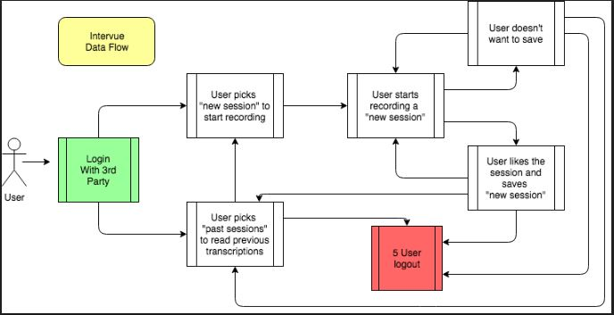
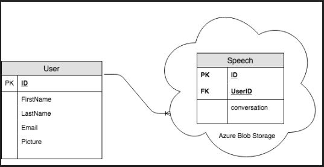
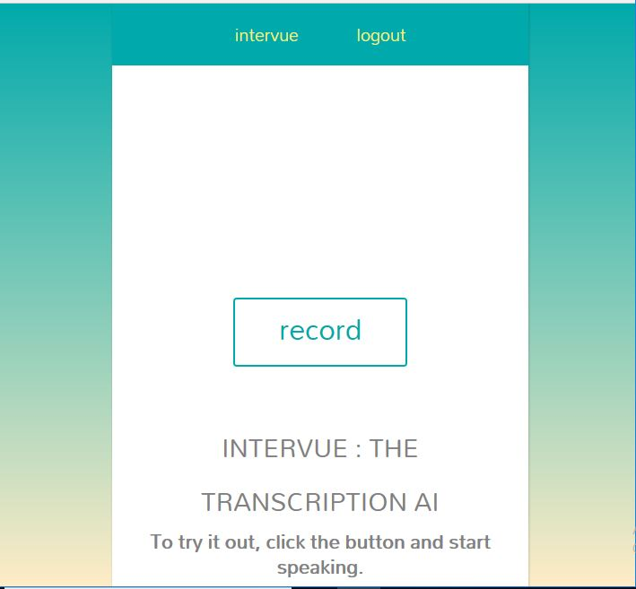
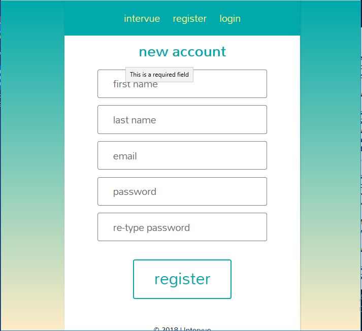
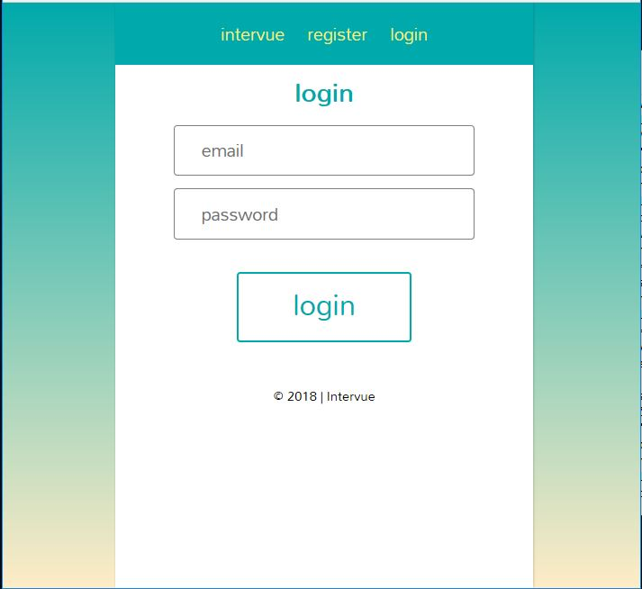
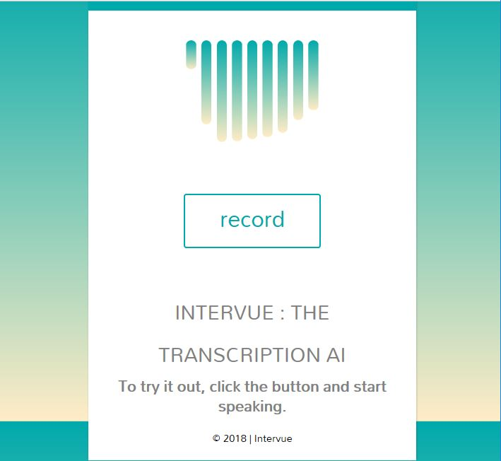
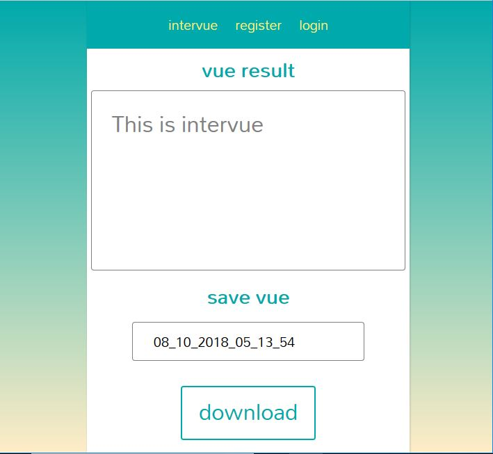
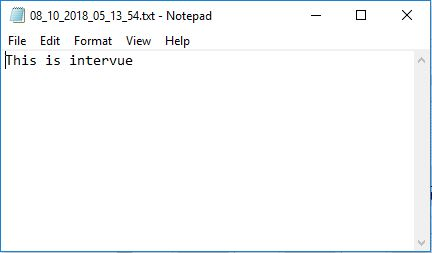

# Introduction
Intervue transcribes spoken audio into text and allows the user to download the results into their local machine. 
Anonymous users can also use the functionality of the site and download the results into a text file but users could also register. Once they login, they can see their previous transcriptions via blob storage.

---
## Software Requirements
Software Requirements can be found [here](/SoftwareRequirements.md).

---
## Dependencies
This application runs on .NET Core 2.1, which can be downloaded [here](https://www.microsoft.com/net/download/macos).

---
## Build
To build this app locally, install the [.NET Core 2.1 SDK](https://www.microsoft.com/net/download/macos), and clone this repo onto your machine. 
Other applications to download are the Speech SDK, which can be downloaded [here](https://docs.microsoft.com/en-us/azure/cognitive-services/speech-service/). As of this writing, the version is at 0.5.

From a terminal interface, go to where this was cloned and type the following commands:

```
cd Intervue
dotnet restore
dotnet run
```
---
## Work flow 
We followed an AGILE workflow. We would conjure up user stories and assign tasks. Once the user stories were available, we would choose on a basis of who wants to complete them. This worked out well. The way we would avoid merge conflicts are by communicating to the team what we would be working on and in what branch. Each new branch would be focused on a specific user story. And we would keep pushing into that branch. 
Once one of us completed the user story, the person working on it would initiate a pull request and let the rest of the team know when the pull request was active. This is because we agreed to have one other team member look over and approve it. 
We would then test functionality to see if the staging would still continue on working. If so, we would keep it the way it is. At the end of the day, we would create a pull request into master. Once this pull request was open, this needed approval from two different team members. This assures master would always be functional.

---
## Data Flow


---
## Database Schema


---
## Walk Through

This is what the user will see first. They will be presented with the Register and Login and Home button (called intervue) in the navbar. Front and center if the Record button. But let's click on register.


Once register is clicked, the user is able to fill out a form and have their information saved in the database. Once they do, they are automatically logged in. But what if they aren't?


If they are already registered and are coming back, they can click on the login button and fill out their information. Let's go to the main functionality.


Clicking on the Record button will cause a modal to show up, letting the user know they are being recorded.


After the recording is done, they are brought to the results of their transcription. It is possible to edit what they said in this. Plus they are given an option to download their results as a text file. This ends up in their MyDocuments folder.


Here are the results of the transcription as a text file.
